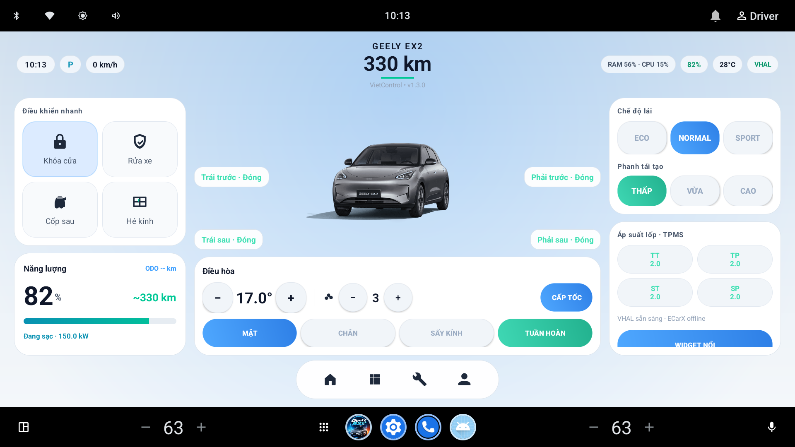
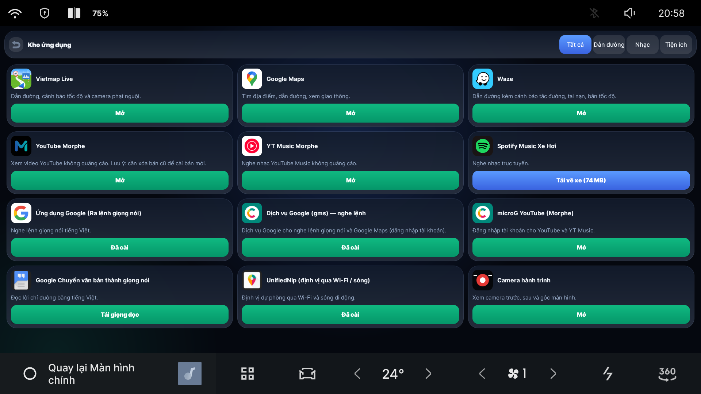
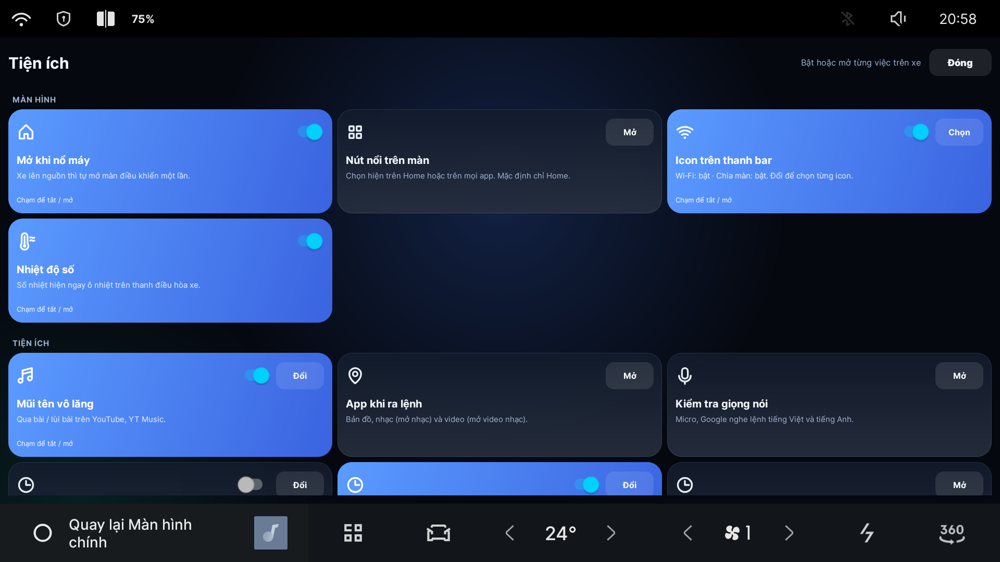
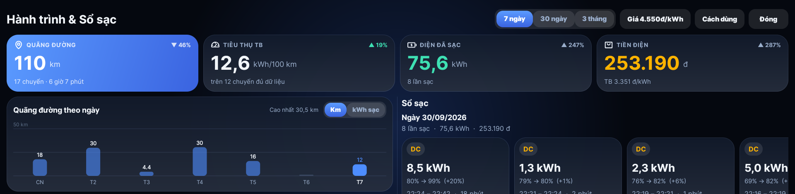

# 🚗 EX2 VN Control

**Ứng dụng điều khiển xe, kho app giải trí và tiện ích dành riêng cho Geely EX2 (bản Việt Nam).**

Thực hiện bởi **Xe Chơi** · 💬 [Tham gia nhóm Zalo](https://zalo.me/g/duikjiadpf81hpdi1r5x)

🌐 [English](README.en.md) · **Tiếng Việt**

-3DDC84?logo=android&logoColor=white)

---

## 📚 Chọn nội dung bạn cần

| | Trang | Nội dung |
|:-:|---|---|
| 📲 | [**Hướng dẫn mở ADB**](docs/ADB.md) | Vào menu ẩn, cài bản vá từ USB, lấy IP và kết nối từ máy tính (làm 1 lần) |
| ⬇️ | [**Cài app EX2 VN Control**](docs/CAI-APP.md) | Cài APK lên xe và cập nhật bản mới (OTA) |
| 🎬 | [**App giải trí và tiện ích**](docs/APP-GIAI-TRI.md) | YouTube, YT Music, Spotify, Vietmap, microG, Google TTS và thứ tự cài |
| ✨ | [**Tính năng đang chạy**](docs/TINH-NANG.md) | Toàn bộ chức năng điều khiển xe, năng lượng, giọng nói, giao diện... |
| 🤖 | [**Điều khiển xe qua Telegram**](docs/TELEGRAM.md) | Hỏi xe, bật điều hòa, khóa cửa, tìm xe từ xa và nhận báo sạc |
| 🛠️ | [**Xử lý lỗi thường gặp**](docs/LOI-THUONG-GAP.md) | Cách sửa các lỗi ADB, cài app, đăng nhập Google |

## 🚀 Bắt đầu nhanh

1. **Mở ADB** trên xe → [làm theo hướng dẫn](docs/ADB.md)
2. **Cài app** [EX2 VN Control](docs/CAI-APP.md) từ [Releases](https://github.com/liemnguyen2107-coder/geely-ex2-vietnam-xe-choi/releases)
3. **Cài app giải trí** (microG → YouTube → Spotify → Vietmap) → [xem danh sách](docs/APP-GIAI-TRI.md)
4. **Ghép Telegram** để điều khiển xe từ xa → [xem cách ghép](docs/TELEGRAM.md)

## ✨ Nổi bật

- 🚘 Khóa cửa, cốp, kính, điều hòa, chế độ lái, phanh tái tạo
- 🔋 Pin, tầm đi, sổ sạc, trụ sạc gần bạn, hành trình GPS
- 🎙️ Ra lệnh giọng nói tiếng Việt, gán phím vô lăng
- 🖥️ Chia hai màn, nút nổi, 3 ô mở app nhanh, giao diện sáng/tối
- 📲 Điều khiển qua Telegram, gửi ảnh và link Maps từ điện thoại
- 🧩 Kho app cài thẳng lên xe

👉 [Xem toàn bộ tính năng](docs/TINH-NANG.md)

## 📸 Hình ảnh

| Màn hình chính | Kho ứng dụng |
|:-:|:-:|
|  |  |
| **Tiện ích** | **Hành trình & Sổ sạc** |
|  |  |

---

## ⚠️ Lưu ý

- Dự án **không chính thức**, không liên kết với Geely. Bạn tự chịu trách nhiệm khi cài app ngoài lên xe.
- Không thao tác điều khiển xe (kính, cốp, chế độ lái…) khi đang chạy nếu chưa chắc chắn về an toàn.
- Các app YouTube / YT Music dạng Morphe, Spotify là bản của bên thứ ba: hãy chỉ dùng cho mục đích cá nhân và tôn trọng bản quyền, điều khoản của nhà cung cấp.
- Chỉ tải APK từ mục [Releases](https://github.com/liemnguyen2107-coder/geely-ex2-vietnam-xe-choi/releases) của repo này để tránh file giả mạo.

> Dành cho người phát hành bản mới: xem [docs/OTA-DEV.md](docs/OTA-DEV.md).

---

Thực hiện bởi **Xe Chơi**

💬 [Tham gia nhóm Zalo Xe Chơi](https://zalo.me/g/duikjiadpf81hpdi1r5x)

